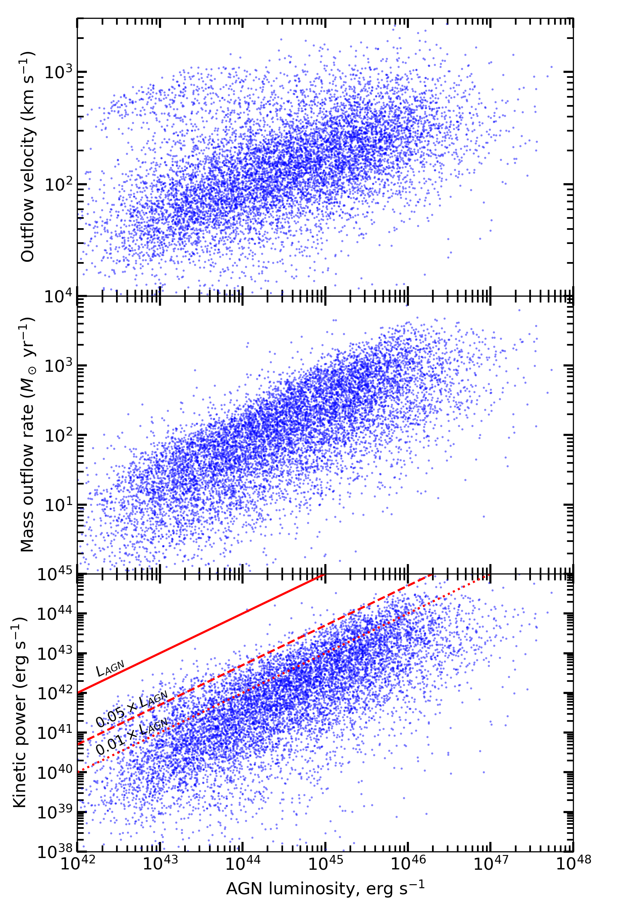

# Magnofit

Magnofit is a library for running 1D outflow simulations of active galactic nuclei (AGNs).

<p align="center" float="left">
  
  
</p>

## Dependencies

[Poetry](https://python-poetry.org/) is used to install dependencies and manage the project's virtual environment.

```bash
poetry install
poetry run pytest
```

## Usage

To generate a sample outflow table run [tools/generate.py](tools/generate.py):

```bash
poetry run python tools/generate.py
```

This will output an Astropy table of outflows in `outputs/outflows.hdf5`. You can inspect it using Python:

```python
outflow_properties = astropy.table.Table.read("outputs/outflows.hdf5")
print(outflow_properties)
```

## Replicating the paper

Generate outflow table with a varied range of parameters:

```bash
poetry run python tools/generate.py
```

This takes around 2.25 hours on 16 cores of an AMD Ryzen 7 3800X CPU.

Train a neural network to predict the duty cycle, quasar activity duration, bulge mass, solid angle fraction and bulge gas fraction of the outflow:

```bash
poetry run python tools/train.py
```

This takes under 12 minutes on an AMD Ryzen 7 3800X processor.

Predict the parameters of real AGN outflows (found in [observed_outflows.csv](observed_outflows.csv)):

```bash
poetry run python tools/predict_real_data.py
```

Generate simulated outflows from the neural-network-predicted parameters of real AGN outflows:

```bash
poetry run python tools/generate_from_real_outflows.py
```

Plot figures and save them to [`figures/`](figures/):

```bash
poetry run ./tools/plot_all.sh
```

## Contributing
Pull requests are welcome. Please open an issue first to discuss what you would like to change.

## License
The project is made available under the MIT license. See the [LICENSE](LICENSE.md) file for more information. If you use this software when preparing a publication, please cite [Zubovas, Bialopetravičius & Kazlauskaitė (2022)](https://ui.adsabs.harvard.edu/abs/2022arXiv220701959Z).
